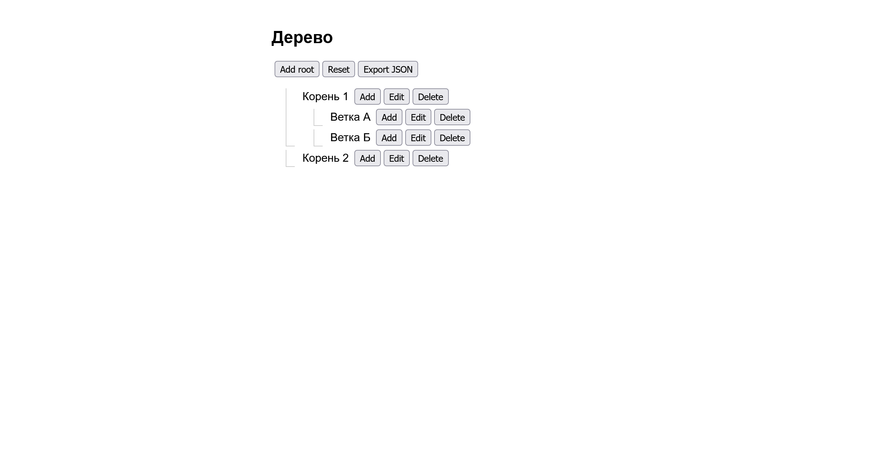

# React Tree Editor

Интерактивный редактор древовидной структуры, созданный с использованием React и TypeScript.

## Возможности

- Добавление корневых и дочерних узлов
- Редактирование и удаление узлов (включая вложенные)
- Сохранение данных в `localStorage`
- Сброс дерева до исходного состояния
- Экспорт дерева в JSON-файл
- Вызов переданной при иницициализации функции

